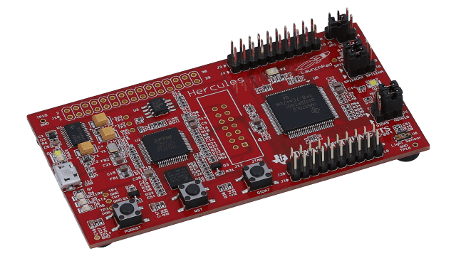
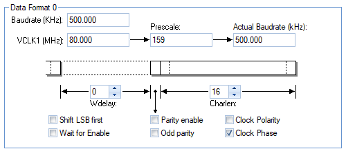

# MPU9250 Driver for TI’s Hercules Microcontrollers

Sensor driver for MPU9250-based IMU modules implemented for HALCoGen API-based Texas Instruments microcontrollers. This specific version has been implemented on a TMS570LS04 ARM Cortex-R4 development launchpad; however, the driver is designed to work with any HALCoGen HAL-based ARM device.

<p align="center">
  
  <br>
  <i>LAUNCHXL-TMS57004</i>
</p>

## Key Features
* Seamless compatibility with any HALCoGen API-based Texas Instruments ARM Microcontroller through a dedicated porting layer.
* Highly structured multi-layer implementation for improved scalability and maintainability.
* Full separation between sensor physics, communication logic & physical SPI transaction mechanics.
* Hardware-agnostic application layer through bare-metal low-level porting.
* Robust Register Abstraction Layer middleware for custom sensor interactions and simplified register operations.
* Straightforward high-level user interface designed for ease of integration.
* Optimized burst read implementation for synchronized 6-DOF sensor states acquisition.
* Comprehensive Register Map for diverse module transactions.

## Quick Start
A minimal IMU acquisition application should implement the following execution flow to achieve a scalable baseline operational state:

1. **Module instantiation**, which allocates an abstraction of MPU9250 (`MPU9250_t`) in RAM and verifies SPI communication.
2.	**Module initialization**, including full system reset, internal clock configuration, and accelerometer and gyroscope full-scale range selection to define sensor sensitivity.
3.	Burst-read sensor acquisition to capture full 6-DOF synchronized sensor raw data + thermometer readings.
4.	Data normalization of 16-bit integer values into significant physical units (e.g. *G*, *°/s (DPS)*, *°C* ).

The following is an example of a minimal, ready to run IMU acquisition application:

```cpp
/* MPU9250 Hello World! */
#include "spi.h"            // TI HALCoGen SPI driver
#include "MPU9250.h"        // Driver library

/* User Typedef BEGIN */
/* 
*  A dedicated 3D floating-point data object
*  is convenient in cartesian data operations
*/
typedef struct {
    float x;
    float y;
    float z;
} Vector3f_t;
/* User Typedef END */

/* User macro BEGIN */
#define CPU_CLK_FREQ 80000000U			// TMS570LS04 runs @ 80MHz
/* User macro END */

/* User fcn BEGIN */
void wait(int delay_ms)     // Generic system delay
{
    uint32_t msrate = CPU_CLK_FREQ / 5000U;
    uint32_t ms_delay_cycles = msrate * delay_ms;

    volatile uint32_t nop;
    for(nop = 0; nop <= ms_delay_cycles; nop++)
        asm(" nop");
}
/* User fcn END */

int main(void)
{
/* USER CODE BEGIN (3) */
    MPU9250_t MPU;
    MPU9250Data_t imuDataRaw;
    Vector3f_t accelData, gyroData;

    applicationInit();       // Initialize System modules

    MPU9250_Init(&MPU, spiREG2, (spiDAT1_t){
        .CS_HOLD = true,        // Hold CS on transaction
        .WDEL = false,          // Wait Delay disabled
        .DFSEL = SPI_FMT_0,     // Using SPI Format 0
        .CSNR = SPI_CS_3        // Using SPI2NCS[3]
    });

    MPU9250_Reset(&MPU);
    wait(100);
    MPU9250_ConfigClk(&MPU, MPU9250_PWR1_CLKSEL_PLL);
    MPU9250_ConfigAccel(&MPU, MPU9250_ACCEL_FS_4G);
    MPU9250_ConfigGyro(&MPU, MPU9250_GYRO_FS_500dps);

    for (;;)
    {
        /* 1. Gyroscope & Accelerometer Read */
        MPU9250_ReadAll(&MPU, &imuDataRaw);         // Burst-read all sensor data

//        Alternatively, each IMU component can be polled individually:
//        MPU9250_ReadGyro(&MPU, &imuDataRaw);
//        MPU9250_ReadAccel(&MPU, &imuDataRaw);

        /* 2. Physical unit scale conversions */
        // Angular velocity (°/s)
        gyroData.x = MPU9250_GetGyro_DPS(imuDataRaw.gyro_x, &MPU);
        gyroData.y = MPU9250_GetGyro_DPS(imuDataRaw.gyro_y, &MPU);
        gyroData.z = MPU9250_GetGyro_DPS(imuDataRaw.gyro_z, &MPU);

        // Acceleration (G)
        accelData.x = MPU9250_GetAccel_G(imuDataRaw.accel_x, &MPU);
        accelData.y = MPU9250_GetAccel_G(imuDataRaw.accel_y, &MPU);
        accelData.z = MPU9250_GetAccel_G(imuDataRaw.accel_z, &MPU);

        wait(250);
    }
    return 0;
}

```

We recommend using a similar structure to `Vector3f_t` to handle converted sensor data within dedicated control loops. Such a data format allows for very convenient and straightfoward data vectoring and integration in wider application sequences.

## Implementation Guide

### Application Layer API

This MPU9250 library implements the following high-level user API functions to simplify sensor data acquisition at an application layer:

```cpp
// MPU9250.h
/* APPLICATION PUBLIC DRIVER API FUNCTIONS */
void MPU9250_Init(MPU9250_t* mpu, spiBASE_t *spi, const spiDAT1_t cfg);
void MPU9250_Reset(MPU9250_t *mpu);
void MPU9250_DisableI2C(MPU9250_t *mpu);
void MPU9250_ConfigClk(MPU9250_t *mpu, MPU9250_ClkSel clk);
void MPU9250_ConfigGyro(MPU9250_t *mpu, MPU9250_GyroRange fs_sel);
void MPU9250_ConfigAccel(MPU9250_t *mpu, MPU9250_AccelRange fs_sel);
void MPU9250_ConfigDLPF(MPU9250_t *mpu, MPU9250_DLPF_BW bw);
void MPU9250_ReadAll(MPU9250_t *mpu, MPU9250Data_t *raw);
void MPU9250_ReadGyro(MPU9250_t *mpu, MPU9250Data_t *raw);
void MPU9250_ReadAccel(MPU9250_t *mpu, MPU9250Data_t *raw);
int16_t MPU9250_ReadTemp(MPU9250_t *mpu);
```

This library implements `MPU9250_t`, which is an abstraction of MPU9250's SPI bus configuration and some of its initialization settings for easier reference on the application layer:

```cpp
// MPU9250_port.h
struct MPU9250_device_config
{
    spiBASE_t *spi_reg;
    spiDAT1_t spi_config;
    uint8_t dev_id;
    float accel_scale;
    float gyro_scale;
};
typedef struct MPU9250_device_config MPU9250_t;
```

Most application interface functions require an **initialized** `MPU9250_t` object pointer to achieve MPU9250 SPI transactions.

`MPU9250Data_t` is a dedicated MPU9250 sensor data container/buffer object:
```cpp
// MPU9250.h
struct MPU9250_IMU_sensor_data {
    int16_t accel_x, accel_y, accel_z;
    int16_t temp;
    int16_t gyro_x,  gyro_y,  gyro_z;
};
typedef struct MPU9250_IMU_sensor_data MPU9250Data_t;
```

Sensor data acquisition functions will require an `MPU9250Data_t` container pointer to store acquired raw 16-bit integer sensor data, whose attributes can later be converted to each application's required measurement unit. 

### HALCoGen Configuration Guide
MPU9250 is driven by HALCoGen's bare-metal SPI interface. This sensor library is based on HALCoGen's SPI API functions. The following hardware configurations are required to enable MPU9250's SPI bus.

<p align="center">
  
  <br>
  <i>MPU9250's SPI Data Format settings in HALCoGen</i>
</p>

* According to MPU's Product Specification, maximum SPI frequency is 1MHz. Sample implementation sets SPI transaction frequency at 500kHz; however, this frequency can be modified as required.
* MPU9250 data is latched on the rising edge of SCLK. SPI must be configured in idle clock high (CPOL = 1) and data capture on falling edge (CPHA = 0) (SPI mode 2).
* MPU9250 word length is ≥ 8. HALCoGen configures SPI word length to 16. Driver's internal SPI transaction primitives handle word length to drive the SPI bus, so no user intervention is required in this setting.
* Data is transmitted MSB first.

`MPU9250_t` is initialized through `MPU9250_Init()` to set an MPU9250 module to a specific TI SPI data format in a given SPI register. Initialization of `MPU9250_t` must be matched to HALCoGen's SPI bus configuration.

```cpp
MPU9250_t MPU;      // MPU9250 Transaction abtraction type

[...]

// Set MPU to SPI2, CS3, using SPI fmt 0
MPU9250_Init(&MPU, spiREG2, (spiDAT1_t){
    .CS_HOLD = true,        // Hold CS on transaction
    .WDEL = false,          // Wait Delay disabled
    .DFSEL = SPI_FMT_0,     // Using SPI Format 0
    .CSNR = SPI_CS_3        // Using SPI2NCS[3]
});
```

**Tip:** `MPU9250_Init()` tests communication with MPU9250 by reading its `WHO_AM_I` register and stores it in its provided `MPU9250_t` object. Verifying the acquired Device ID value can be a useful sanity check to easily test SPI communication and proper functioning of an MPU9250 module.


### Wiring Guidelines

--- coming soon ---

## Application Remarks

--- coming soon ---

### Driver Structure

### Library Design

## Version Highlights

--- coming soon ---